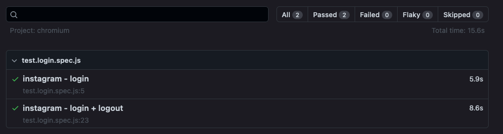

# playwright-demo
Tests using playwright automation framework

## Challenge
Demonstate the Page Object method for UI tests against a web app. 

## Credentials
Fill out the user creds using `.env.template` and rename to `.env`

## Run
Use `npm test` for headless or run UI mode using `npx playwright test --headed`.

Append `--reporter=html` a html report.

